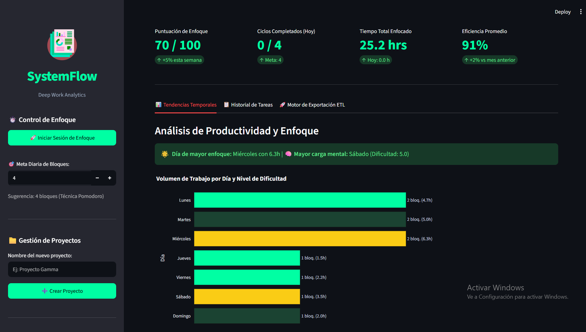
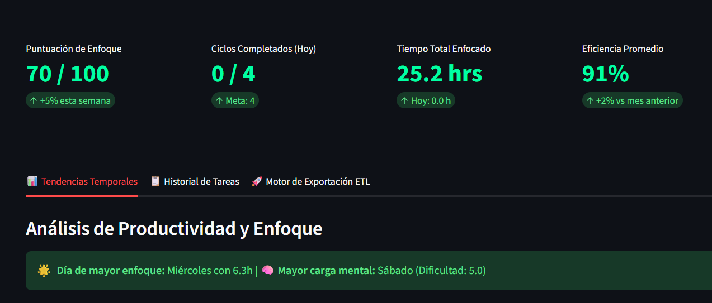
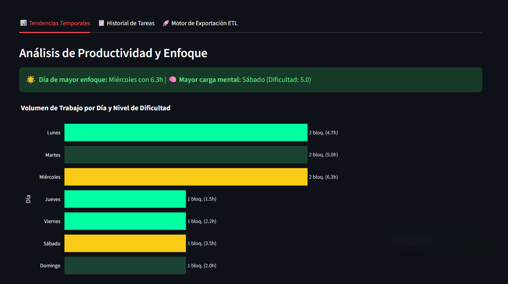
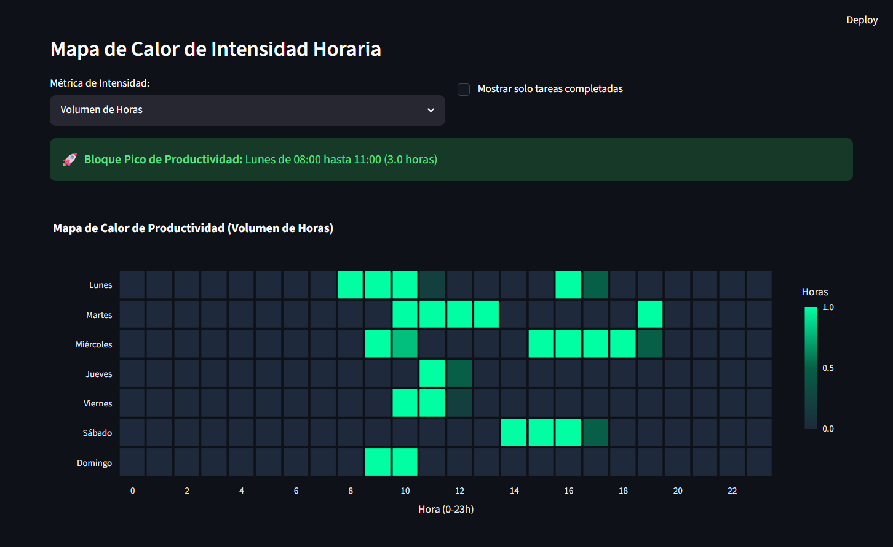
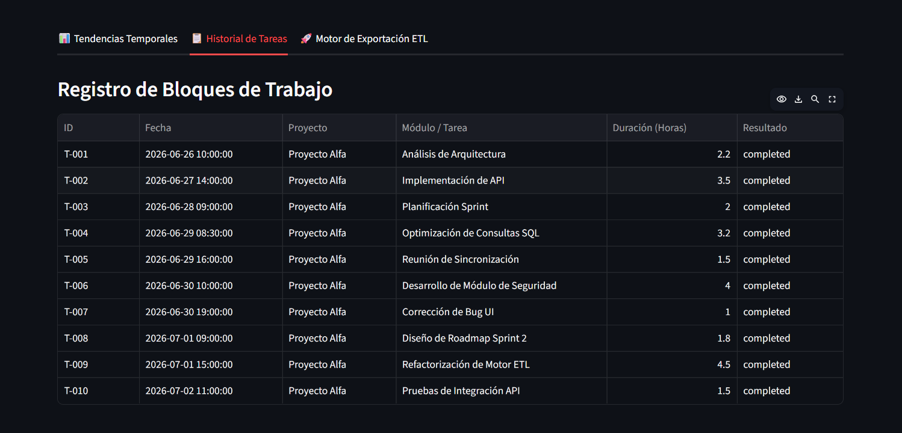
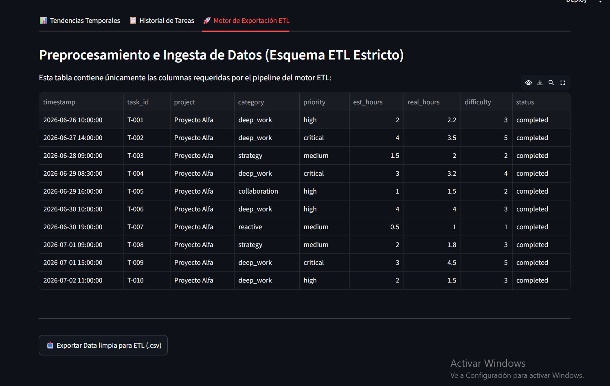

# SystemFlow ⚙️

**SystemFlow** es una plataforma de análisis de productividad diseñada para medir y optimizar el tiempo de trabajo profundo (*deep work*). El sistema registra sesiones de trabajo, calcula métricas de enfoque mediante lógica de negocio personalizada y visualiza tendencias mediante análisis de datos en tiempo real.

## 🛠️ Stack Tecnológico
- **Frontend:** Streamlit para la visualización de datos y el dashboard interactivo.
- **Backend:** FastAPI (Python) para la gestión de APIs y persistencia de datos.
- **Data Science:** Pandas y Plotly para el procesamiento, limpieza y análisis de tendencias.
- **Base de Datos:** SQLite para despliegue local sencillo.

## 📂 Estructura del Proyecto
La aplicación sigue una arquitectura modular basada en la separación de responsabilidades:

```text
systemflow/
├── app.py              # Punto de entrada principal de la aplicación
├── core/               # Lógica de negocio y procesamiento de datos
│   ├── state.py        # Gestión del estado de la sesión
│   ├── etl.py          # Pipeline de limpieza y normalización de datos (Esquema ETL)
│   └── api_client.py   # Cliente singleton para comunicación con el Backend
├── ui/                 # Diseño y presentación de la interfaz
│   ├── styles.py       # Definiciones de CSS y estilos visuales
│   └── layout.py       # Estructura de la página, sidebar y componentes del dashboard
├── backend/            # API REST y persistencia de datos
│   ├── main.py         # Punto de entrada de FastAPI y CORS
│   ├── database.py     # Configuración de SQLAlchemy y sesión de DB
│   ├── models.py       # Modelos ORM (Project, Task, FocusSession, UserSettings)
│   ├── schemas.py      # Modelos de validación Pydantic
│   ├── crud.py         # Lógica de acceso a datos (Create, Read, Update, Delete)
│   └── api/            # Definiciones de rutas por entidad
│       ├── projects.py # Endpoints de gestión de proyectos
│       ├── tasks.py    # Endpoints de gestión de tareas (incluye Bulk Load y Delete)
│       ├── focus.py    # Ciclo de vida de sesiones de enfoque
│       └── settings.py # Gestión de preferencias de usuario
├── data_analysis/      # Motor de cálculo de métricas y Focus Score (Sprints futuros)
└── requirements.txt    # Dependencias del proyecto
```

## 🚀 Ejecución Local (IMPORTANTE)

Debido a la arquitectura desacoplada, **debes ejecutar el Backend y el Frontend simultáneamente en dos terminales separadas**.

### Paso 1: Lanzar el Backend (API)
Abre una terminal y ejecuta:
```bash
uvicorn backend.main:app --reload
```
*El servidor debe quedar corriendo en `http://localhost:8000`. No cierres esta terminal.*

### Paso 2: Lanzar el Dashboard (Frontend)
Abre una **segunda terminal** y ejecuta:
```bash
streamlit run app.py
```

## 📸 Galería de Visualizaciones

### Interfaz principal de la aplicación


| Vista | Descripción | Captura |
| :--- | :--- | :--- |
| **Dashboard Principal** | Vista general de KPIs: Focus Score, Ciclos y Eficiencia. |  |
| **Análisis de Volumen** | Tendencias diarias con Insights de rendimiento automáticos. |  |
| **Mapa de Calor** | Análisis dinámico de intensidad horaria y carga mental. |  |
| **Registro de Bloques de Trabajo** | Interfaz de registro de bloques de trabajo. |  |
| **Motor de exportación de datos** | Motor de exportación de datos en formato CSV para análisis externos   . |  |

## 📅 Hoja de Ruta (Roadmap)
El desarrollo está dividido en sprints técnicos para asegurar la escalabilidad:

### Sprint 1: Backend & Persistencia (Completado ✅)
- [x] Implementación de FastAPI y estructura modular.
- [x] Definición de modelos de datos con SQLAlchemy (Sincronizados con `DATA_SCHEMA.md`).
- [x] Creación de endpoints CRUD para Proyectos, Tareas y Preferencias.
- [x] Lógica de ciclo de vida de Sesiones de Enfoque (Backend-owned) con recuperación de sesión.
- [x] Integración total del frontend con la API mediante `APIClient`.
- [x] Optimización de latencia (eliminación de redirecciones HTTP 307).
- [x] Herramientas de mantenimiento: Eliminación de tareas y Carga Masiva (Bulk Load) vía API.

### Sprint 2: Lógica de Análisis (Próximo)
- Desarrollo del motor de cálculo de la "Puntuación de Enfoque" (*Focus Score*) avanzado.
- Agregaciones temporales avanzadas para detección de picos de productividad.

### Sprint 3: Integración Final
- Conexión total del frontend con la API para visualizaciones avanzadas del Focus Score.
- Refinamiento de la UX basada en datos analíticos.

## 🛠️ Especificaciones Técnicas Obligatorias

- **Lógica de Indicadores (KPIs)**:
    - **Focus Score**: Cálculo basado en la precisión de estimación (Diferencia entre `est_hours` y `real_hours`).
    - **Ciclos Completados**: Conteo de tareas `completed` del día actual frente a una meta configurable en el Sidebar.
    - **Tiempo Total**: Suma de `real_hours` del proyecto, con indicador de progreso diario.
    - **Eficiencia Promedio**: Ratio de rendimiento ($\frac{\sum \text{est\\_hours}}{\sum \text{real\\_hours}}$) capado al 120%.
- **Configuraciones de Usuario**:
    - **Meta Diaria**: Control ajustable en la interfaz para definir el objetivo de bloques diarios (predeterminado: 4 bloques).

    - **Visualización de Datos**: 
        - El análisis de eficiencia diaria utiliza un código de colores basado en la dificultad promedio: Verde Oscuro (Baja) $\rightarrow$ Verde Neón (Media) $\rightarrow$ Ambar Eléctrico (Alta).
        - El Mapa de Calor de Productividad es un motor de análisis dinámico que visualiza la intensidad del trabajo mediante:
            - **Métricas Seleccionables**: Permite alternar entre *Volumen de Horas*, *Cantidad de Tareas* y *Carga Mental* (Horas $\times$ Dificultad).
            - **Expansión Temporal**: Distribuye la duración de las tareas a lo largo de los bloques horarios, reflejando la ocupación real en lugar de solo el inicio de la tarea.
            - **Detección de Bloques Pico**: Identifica y resalta el rango horario continuo de máxima productividad basándose en la intensidad acumulada.
            - **Escalado Dinámico**: Ajusta automáticamente la barra de colores al valor máximo real y normaliza los ticks según la métrica (enteros para tareas, decimales para horas/carga).
            - **Estética Profesional**: Utiliza una escala de color Azul Pizarra (`#1E293B`) $\rightarrow$ Verde Bosque (`#065F46`) $\rightarrow$ Verde Neón (`#00FFA3`) con celdas separadas (gaps).
        - El gráfico de Volumen de Trabajo por Día incluye **Insights de Rendimiento** automáticos para identificar el día de mayor enfoque y carga mental.
        - **Mejoras Pendientes**: Implementación de ordenamiento dinámico (por volumen/dificultad) y sincronización visual avanzada de paletas entre gráficas.

- **Exportación de Datos**: Cualquier exportación de CSV debe seguir estrictamente el `DATA_SCHEMA.md`.
    - Formato de Fecha: ISO 8601 (`YYYY-MM-DD HH:MM:SS`).
- **Colores de Interfaz**: Uso de paleta Dark Mode con acentos en Verde Neón (`#00FFA3`) para acciones positivas y Rojo (`#FF4B4B`) para detenciones.
- **Sincronización**: El cronómetro de enfoque alimenta automáticamente la duración de las tareas registradas.
- **Optimización de Rendimiento**: Implementación de "Modo Análisis" para desactivar el polling de sesiones activas cuando no hay un ciclo de enfoque en curso, reduciendo la latencia de la interfaz y el tráfico innecesario al servidor.


